# 如何使用git进行多人协作开发

## 一、登录

    1、打开网页：
    https://lab.github.com/githubtraining/introduction-to-github

    2、点击绿色按钮Sign in with GitHub

    3、跳转页面后继续点击绿色按钮Authorize GitHub Learning Lab by GitHub
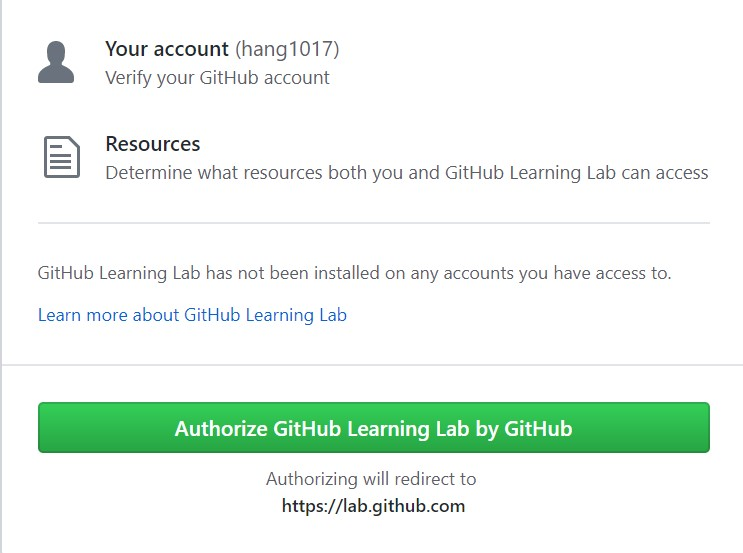

    4、稍等5秒钟吧，会进行跳转页面，也可能我电脑差，速度慢。

    5、跳转页面完成后，需要你们同意学习条款，不愿意看的小伙伴就拉到最下面吧

    6、点击接受条款和条件即可

## 二、在您的个人帐户中安装GitHub Learning Lab

    1、点击下图中的绿色按钮，在所有个人存储库上安装

    2、跳转页面后install即可，如下图所示
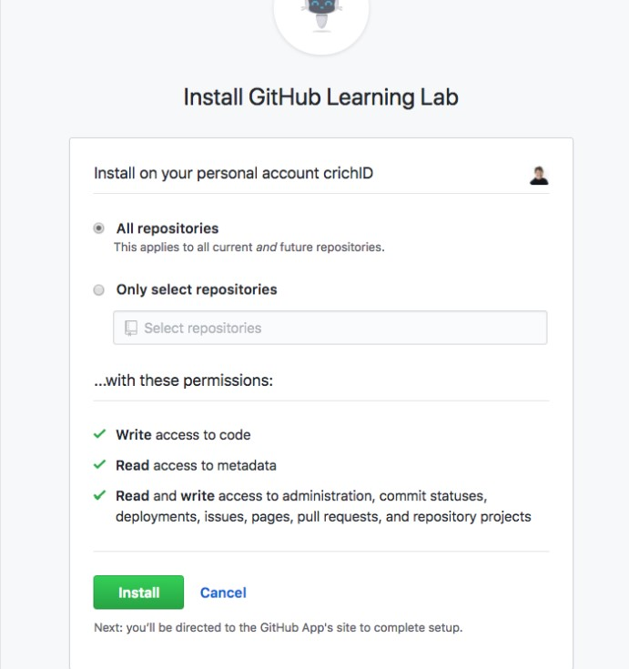

    3、登录你的账户后，跳转到如下界面：
  

    4、选择浏览课程

    5、选择下图的课程GitHub简介，并点击Introduction to GitHub
  

    6、如果界面如下图所示，恭喜你已经下载好课程，可以开始学习了哦
 

## 三、学习
    1、选中Assign yourself,如下图所示
 

### 1、第一课

    1、此为第一课的内容，我展示中文版文字给小伙伴们看，小伙伴们用英文版操作就好了哈
 

    2、找到右上角Assignees如下图所示，点击右边设置按钮
     

    3、选择你的账号，如下图所示
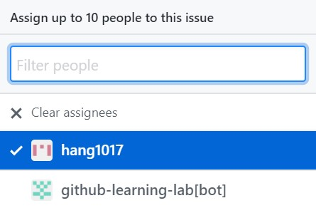 

### 2、第二课
    1、看下图，可以点击图中蓝色的“设置文字”，进入设置界面
 

    2、向下滑动，来到gitHub page部分，如下图所示
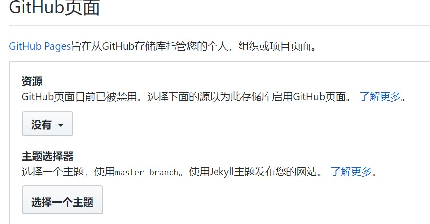

    3、选中source下方的下拉选择框，选择master branch
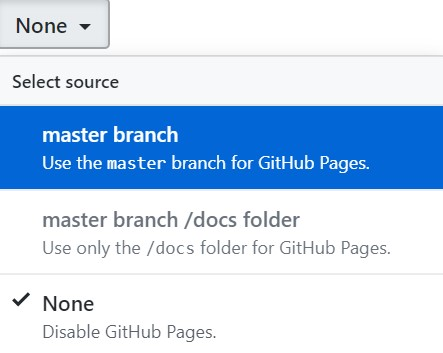  

    4、选中完，就会有一条邮件发送到你的邮箱。现在你的网站对公众可见啦。邮箱的内容为第三课的操作内容。我们往下走即可

## 3、第三课

    1、来看第三课要做些什么？
     

    2、当我们完成这个问题的任务，就是时候关闭了，关闭问题会告诉其他贡献者这个特定的对话或任务已经结束。

        我们只需要向下滑动鼠标到底部，点击Close issue如下图所示，即可
   

    3、好的，现在我们关闭了问题，稍微向上滑动一点，来到如下图的界面，点击 the next issue转到下一期哈
    

   ## 4、第四课

    1、我们的任务是创建一个分支，可以看下下图的任务介绍和步骤：

    2、那现在我们跟着步骤走吧：

    3、点击蓝色字体code tab
  

    4、选中Branch :master
   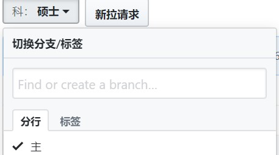  

   5、在该字段中输入分支的名称，如：my-slide  如下图所示：
   

    6、单击“create branch” 或者按下enter键来创建分支
  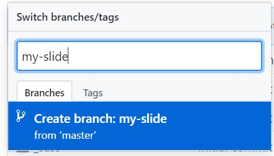 

    7、那么现在我们可以看到分支创建完啦！
  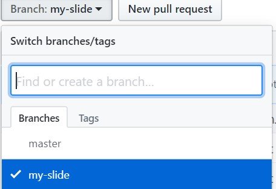   

  ## 5、第五课

    1、来看一下第五课要做些什么哈
     

    2、再看看我们的步骤是什么：
  

    3、打开“代码选项卡” 选中我们刚刚创建的分支，如下图所示
  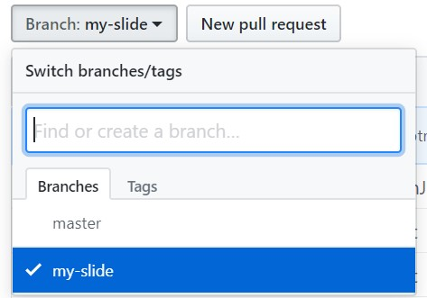 

        当然在这里可以有个骚操作：点击蓝色文字的此快捷方式
  

        你可以一下到达底6步，不过我建议你要每个步骤都尝试一下哈！

    4、找到该分支下的_posts文件
   

    5、点击create new file
    

    6、在该输入框中输入你要创建的文件的名称，如下图所示：0000-01-02-hang1017.md    

    7、主体内容如下图所示：
        ---
        layout: slide
        title: "Welcome to our second slide!"
        ---
        Your text
        Use the left arrow to go back!

    

    8、鼠标滑动到最下方，点击commit new file

    9、好哒，现在我们就可以看到文件已经被你创建成功啦！如下图所示：
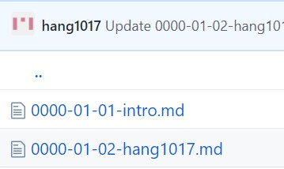

## 6、第六课：

    1、这里我们要完成的任务是什么呢：

    2、来看一下步骤：
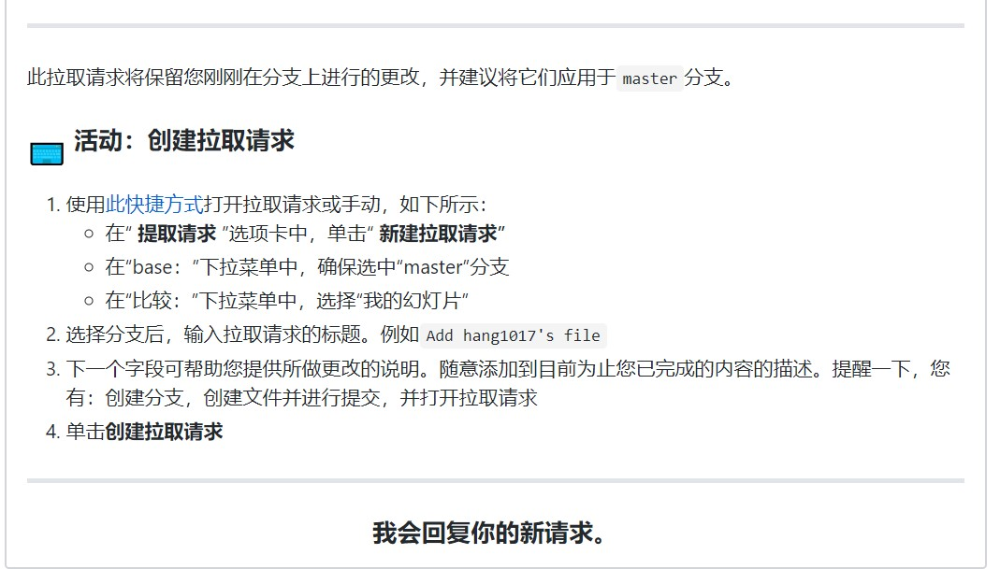

    3、该地方一样有骚操作，我就不细说，我每步讲解哈：
    打开上面标签页中的pull requests(拉取请求) tab，如下图所示：
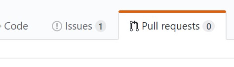

    4、点击new pull request(新建拉取请求)

    5、选择my-slide分支：
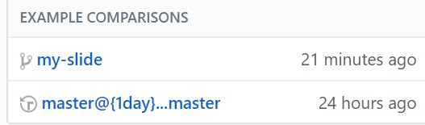

    5、确保选择是正确的：

    6、点击Create new pull request 创建新的拉取请求
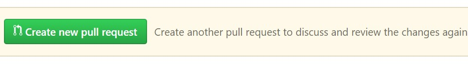

    7、输入你要创建拉取请求的标题：
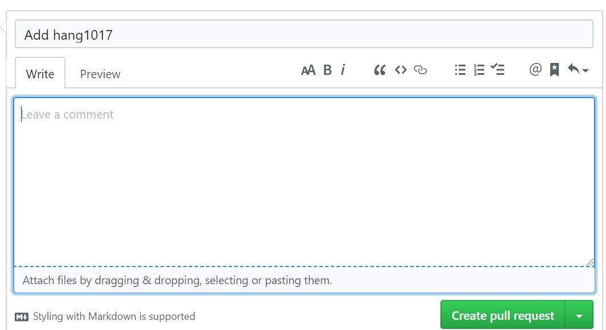

    8、点击提交即可完成此课程啦！

## 7、第七课

    1、接下来我们对分支上的文件进行修改：

        点击Files changed tab 

    2、选中你要修改的信息，然后点击屏幕右侧的铅笔图标

    3、在第5行新增加一点文字，随意即可
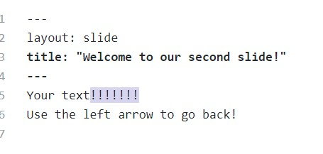

    4、鼠标滑动到底部，点击Commits Changes(提交)

## 8、第八课

    1、接下来我们来合并拉取过来的请求：

    2、鼠标向下滑动，点击Merge pull request(合并拉取请求)

    3、再次确认一下：
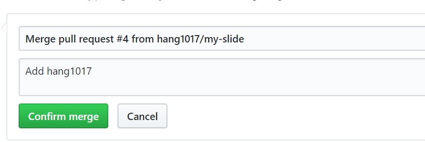

    恭喜你，操作成功啦！是不是感觉自己棒棒哒！
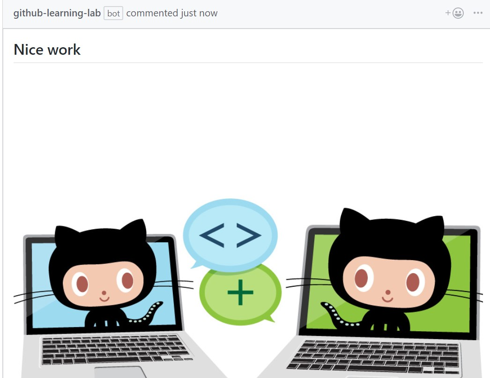

