## 1、F12调试按钮
    首先用你的谷歌浏览器打开你所要操作的页面，并点击F12，即可看到如下图所示：
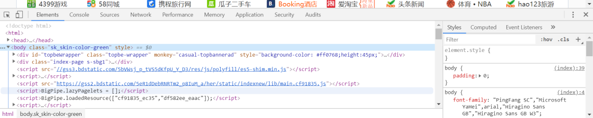

    有可能一开出现在浏览器的右侧，会影响到你的布局，没有关系。

    看到右上角有竖着三点的按钮，如下图所示：  
    
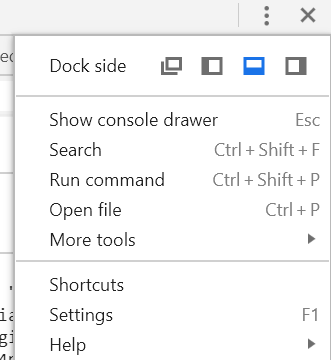

    根据你的需求进行dock side的切换，一般情况下，会显示在浏览器下方。

## 2、快速定位
    点击调试界面的左上方有一个鼠标按钮，如右图所示：
。
当你选中时，图标会编程蓝色，如右图所示：

    让此图标呈选中状态，把鼠标移至你所要操作的控件上，如下图所示：

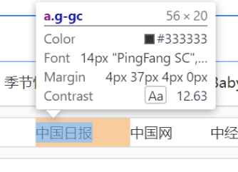

你所选中的控件会被阴影覆盖，会有一个显示层，如上图所示，

横线上方显示控件的名称，类名，和空间的大小。
横线的下方显示空间的样式。
选择你所要的控件，点击此控件。

调试界面会跳出此界面，如下图所示：
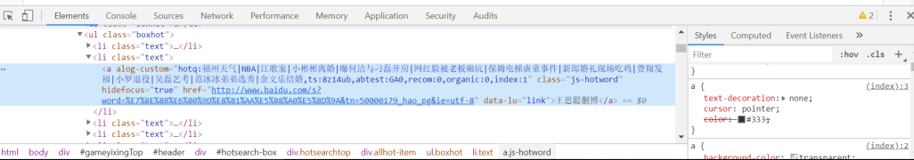
左边蓝色的框即为你选中的控件的代码，右边为此控件的样式。

对于右边控件的样式，你可以点击进行修改操作，更加直观的调整你的布局，当调整好后，再去修改你的代码，可以节省很多切换界面的时间。

继续看右边的界面，你会找到如右图所示：

styles:为查看你的样式，上图已说，这里不再细说。

点击Computed，即可看到如下图所示：

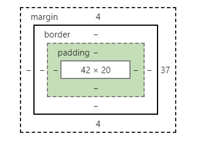

把鼠标移到上面，即可看到你所选控件的空间布局。

## 3、断点调试：

这个为调试器。如下图所示，点击打开：

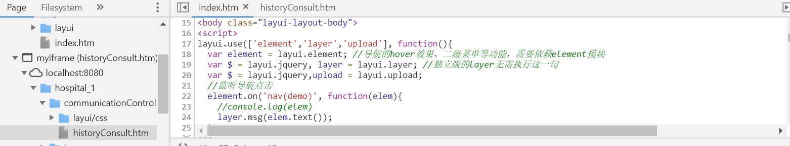

打开后可看到左边为你的项目目录，你可以选择你所需要调试的文件，选中你所要调试的文件，右边便会弹出文件内容。

找到你所要调试的代码，点击该行的条目数，会出现如下图所示：

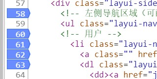

如果所要调试的是该页面，则刷新就可进行调试，如果是对某操作的调试，则进行该操作进入调试。

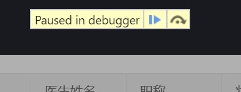

如出现上图所示，则标识成功进入到调试状态

蓝色按钮(第一个按钮 or F8)：切换到下一个断点位置，如果已是最后一个断点则结束调试。

黑色按钮(第二个按钮 or F10)：执行下一步操作，如果已是最后一个步骤，则结束测试。

## 4、查看请求接口

下图为网络，可以用来查看请求的接口

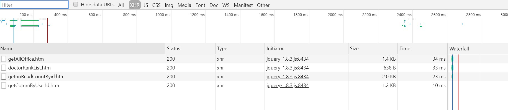

打开后即可看到上图所示界面。

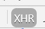

上图这个按钮可以用来过来http的请求，能够快速找到请求接口

选中你所要查看的接口

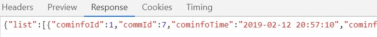

上图为查看http响应，不过数据结构很难看出来，可以选用下面的按钮

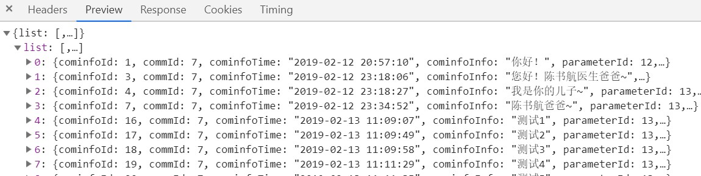

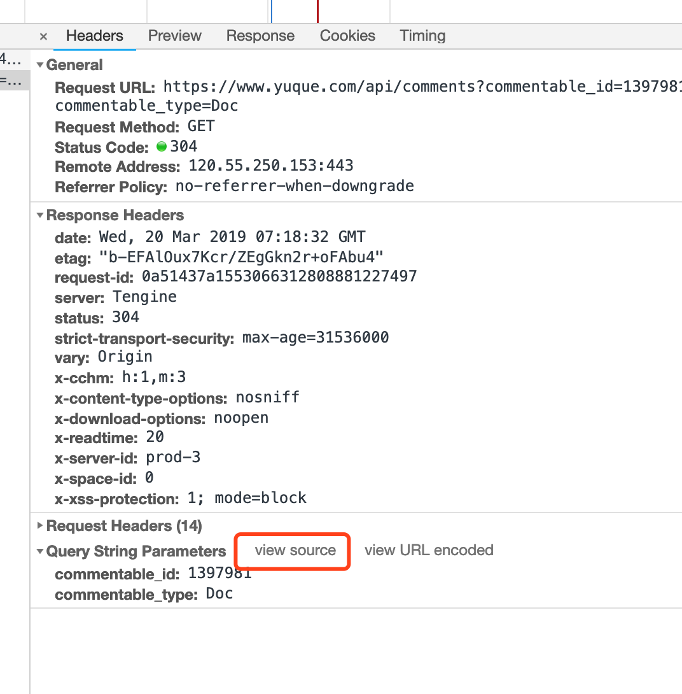

上图能够看到请求头和响应头的消息

上图红色圈出来的按钮可以用于拷贝入参，很高效

上图可以快速查看到console的警告和错误数量

## 5、数据存储

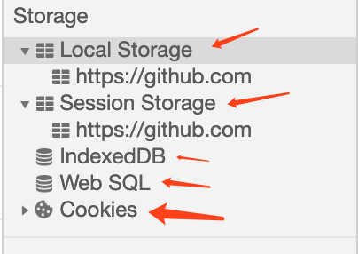

该面板主要记录了网站加载的所有资源信息，包括存储数据等

### 1、Local Storage

主要用来作为本地存储使用，解决cookie存储空间不足的问题（cookie中每条cookie的存储空间是4k，local storage 中一般浏览器支持5M）

优势：

1、localStorage拓展了cookie的4K限制

2、localStorage会可以将第一次请求的数据直接存储到本地，这个相当于一个5M大小的针对于前端页面的数据库，相比于cookie可以节约带宽

缺点：

1、浏览器中都会把localStorage的值类型限定为string类型，json类型的对象需要一些转换

2、浏览器的大小不统一

3、存储过多会造成页面变卡

4、与sessionStorage对比：ls为永久性保存，ss当会话结束时键值就会被清空

### 2、Session Storage

用于临时保存同一窗口(或标签页)的数据，在关闭窗口或标签页之后将会删除这些数据

### 3、indexedDB

Web Storage使用简单字符串键值对在本地存储数据，方便灵活，但是对于大量结构化数据存储力不从心，IndexedDB是为了能够在客户端存储大量的结构化数据，并且使用索引高效检索的API

### 4、web sql

WebSQL是前端的一个独立模块，是web存储方式的一种

主要方法：

    openDatabase：这个方法使用现有的数据库或者新建的数据库创建一个数据库对象。

    transaction：这个方法让我们能够控制一个事务，以及基于这种情况执行提交或者回滚。

    executeSql：这个方法用于执行实际的 SQL 查询。

### 5、cookies

cookie在生成时会被指定一个expire值，这就是cookie的生命周期，超出时间，cookie就会被删除，可以有效的保护个人隐私

## 6、其他操作

上图最左边的类似手机图像的按钮：能切换移动设备模式，用于调试移动端页面很有效

Elements：查看器，步骤2已说过，在补充一点：把鼠标移到代码上，相应的控件会有颜色标识，也能够快速定位。

Console：控制台，js上的输出，你所引用的路径，会在此显示出来。

Sources：调试器，3已说明

NetWork：网络，4已说明

其他的基本没什么用，就不用说了。

