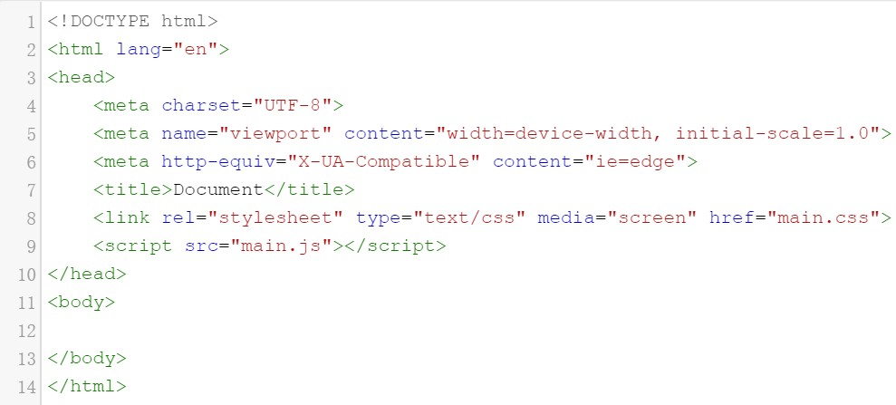

    
# HTML语言基础功能

# 一、标签的含义

## 一、<!DOCTYPE html

    声明必须是 HTML 文档的第一行，位于 <html> 标签之前

    <!DOCTYPE> 声明不是 HTML 标签；它是指示 web 浏览器关于页面使用哪个 HTML 版本进行编写的指令。

    在 HTML 4.01 中，<!DOCTYPE> 声明引用 DTD，因为 HTML 4.01 基于 SGML。DTD 规定了标记语言的规则，这样浏览器才能正确地呈现内容。

    在 HTML 4.01 中有三种 <!DOCTYPE> 声明。在 HTML5 中只有一种：<!DOCTYPE html>

## 二、<html

    该标签定义了文档的开始点和结束点，在他们之间是文档的头部和主体。

### 属性

#### 1、lang="en" or "zh"

    表示该页面的html语言
    en代表english
    zh代表中文

#### 2、 

## 三、<head

    该标签定义文档的头部，所有头部元素的容器。

    描述了文档的各种属性和信息

    头部包含的数据都不会真正的作为内容显示给读者

## 四、<meta

    用来描述一个HTML网页文档的属性。
    全名：metadata  中文：元数据
    用来描述数据的数据
    位于<head>和<title>之间
    不会显示在页面上，但是机器却可以识别

    meta常用于定义页面的说明(Description)，关键字(Keywords)，最后修改日期和其他的元数据。

    这些数据将服务于浏览器，搜索引擎，其他网络服务

    
    <meta>除了提供文档字符集，使用语言，作者等基本信息，还涉及对关键词和网页等级的设定
    合理利用meta标签的Description和Keywords属性，加入网站的关键字或者网页的关键字，可使网站更加贴近用户体验

### META标签可以分为两大部分

    HTTP-EQUIV和NAME变量

    http-equiv:相当于http文件头的作用可以向浏览器传回一些有用的信息以帮助正确的显示网页的内容，把content属性关联到http头部

    name:把content属性关联到一个名称

###属性（常用）

#### 1、Description描述设计（下面第5点有继续说明）

    1、自然语言
    2、尽可能准确描述网页的核心内容，比如摘要信息
    3、有效关键词
    4、网页描述内容与标题内容高度相关性
    5、网页描述内容与主体内容高度相关性

#### 2、Keywords

    1、关键词
    2、还应考虑用户易于通过搜索引擎检索的
    3、尽量不要用到生僻字
    4、不要堆砌太多关键字

#### 3、charset="UTF-8"

    charset规定HTML文档的字符编码

#### 4、name="viewport"  content="width=device-width, initial-scale=1.0"    
    此参数为配置移动端的界面，具体参数参照下个条目

    width=device-width  //应用程序的高度和屏幕的宽度是一样的
    width=device-height //应用程序的高度和屏幕的高是一样的
    initial-scale=1.0   //应用程序启动时候的缩放尺度（1.0表示不缩放）
    minimum-scale=1.0   //用户可以缩放到的最小尺度（1.0表示不缩放）
    maximum-scale=1.0   //用户可以缩放到的最大尺度（1.0表示不缩放）
    user-scalable=no    //用户是否可以通过他的手势来缩放整个应用程序

#### 5、name="description" content="Contribute to hang1017/fontDemo development by creating an account on GitHub."

    description:其中包含页面内容的简短而准确的摘要。一些浏览器，如Firefox和Opera，使用它作为书签页面的默认描述

    content:这里是网页的描述，是给搜索引擎看的，搜索引擎根据这个描述进行收录排名，一般是网页内的关键字（简单点说：指定搜索引擎显示的网页快照）

#### 6、robots(定义搜索引擎爬虫的索引方式)

    robots用来告诉爬虫哪些页面需要索引，哪些页面不需要索引

    书写方式：
        <meta name="robots" content="none">

    具体参数如下：
        1、none:搜索引擎将忽略此网页，等价于noindex,nofollow
        2、noindex:搜索引擎不索引此网页
        3、nofollow：搜索引擎将索引此网页的链接索引搜索其他的网页
        4、all(默认):搜索引擎引此网页与继续通过此网页的链接索引，等价于index,follow
        5、index:搜索引擎引此网页
        6、follow:搜索引擎继续通过此网页的链接索引搜索其他的网页

#### 7、aythor(作者)

    用于标注网页作者

    举例：
        <meta name="author" content="Lxxxyx,437100000@qq.com" >

#### 8、generator(网页制作软件)

    用于标明网页是什么软件做的举例：

    举例：
        <meta name="generator" content="Sublime Text3" >

#### 9、copyright(版权)

    用于标注版权信息

    举例：
        <meta name="copyright"  content="Lxxyx" >

#### 10、revisit-after(搜索引擎爬虫重访时间)

    用于标注版权信息举例：

    举例：
        <meta name="revisit-after" content="7 days" >

#### 11、renderer(双核浏览器渲染方式)

    renderer是为双核浏览器准备的，用于指定双核浏览器默认以哪种方式渲染页面

    例子：
        <meta name="renderer" content="webkit"> //默认webkit内核
        <meta name="renderer" content="ie-comp"> //默认IE兼容模式
        <meta name="renderer" content="ie-stand"> //默认IE标准模式

###属性（不常用）

#### 12、<meta property="fb:app_id"

    fb:app_id:该标记将允许Facebook刮刀将该url的Open Graph实体与应用程序相关联，将允许任何管理员查看有关该url以及其相关的任何社交插件的数据洞察

#### 13、<meta property="og"

    og:是一种新的HTTP头部标记，即Open Graph Protocol
        让网页成为一个“富媒体对象”
        同意其他网站可以引用本页面内容，目前这种协议被很多SNS网站（Social Network Service，社交网络服务）采用

    例子：
        //图片所在路径
        <meta property="og:title" content="hang1017/fontDemo">

        //页面所在网站名
        <meta property="og:site_name" content="GitHub">

        //页面的类型
        <meta property="og:type" content="object">

        //页面的标题
        <meta property="og:title" content="hang1017/fontDemo">

        //页面的url
        <meta property="og:url" content="https://github.com/hang1017/fontDemo">

        //页面的简单描述
        <meta property="og:description" content="Contribute to hang1017/fontDemo development by creating an account on GitHub.">

#### 14、<meta name="pjax-timeout" content="1000"

    传统的ajax方式可以异步无刷新的改变页面内容，但是无法改变页面url

    因此有种方案是在内容发生改变后改变url的hash方式获得恒昊的可访问性，但是hash有时不能很好的处理浏览器的前进后退，而且常规代码要切换到这种方式要做不少的额外处理（浪费）

    pjax出现，为了解决这些问题，简单的说就是ajax的加强

    pjax结合pushState、ajax技术，不需要重新加载整个页面就能从服务器加载html到你当前的页面，这个ajax请求会有永久链接、title  并支持浏览器的前进/回退按钮。

    优点：
        1、减轻服务端压力
        2、优化页面跳转体验

    缺点：
        1、不支持一些低版本的浏览器（如IE系列）
        2、使服务端处理变得复杂

    参数/默认值/说明：
        1、timeout  650 ajax超时时间，超时默认页面跳转，一般默认值
        2、push true    改变地址栏url(会添加新的历史记录)
        3、replace  false   改变地址栏url(不会添加历史记录)
        4、maxCacheLength   20  缓存的历史页面个数
        5、version      是一个函数，跳转时设置于当前页面不同的版本号，可强制页面跳转而不是局部刷新
        6、scrollTo 0   页面加载后的垂直滚动距离
        7、type "GET"   请求方式
        8、dataType "html"  响应内容的Content-type
        9、container        用于查找容器的CSS选择器
        10、url link.gref   跳转的连接
        11、fragment        对请求到的页面做截取

#### 15、<meta name="request-id" content="C814:3857:77BCA:E2400:5C92E7FE" data-pjax-transient=""
    

 #### 16、<meta name="selected-link" value="repo_source" data-pjax-transient=""   

#### 17、<meta name="google-site-verification" content="KT5gs8h0wvaagLKAVWq8bbeNwnZZK1r1XQysX3xurLU"

    google-site-verification：这是google网站管理员的特定元标记
    google的网站认证代码，证明这个网站的所有者是你。

    和google排行收录有关系
    有利于Google的爬虫搜录页面

#### 18、<meta name="octolytics-系列“

#### 19、<meta class="js-ga-set"

#### 20、<meta name="hostname" content="github.com"

    hostname:当前的url的根地址

#### 15、<meta name="user-login"   

    user-login:当前登录名

#### 21、<meta name="go-import"

    引入go语言包

    <meta name="go-import" content="pkg git repo">
    pkg: 包名，例如gopkg.in/yaml.v2
    git: 版本控制系统
    repo: 源代码地址，例如https://github.com/go-yaml/yaml.git

#### 22、<meta name="theme-color" content="#1e2327"

    控制选项卡的颜色

    当用户访问网页时，浏览器会尝试从html中提取图标，图标可能出现在许多地方，包括浏览器标签，最近应用切换，新的标签访问等

    而安卓手机中浏览器Chrome,就支持这类功能
    可以实现顶栏header bar 和地址栏 address bar的多彩的颜色

#### 23、http-equiv="X-UA-Compatible" content="ie=edge"

        X-UA-Compatible：

            针对IE8新加的一个设置，对于IE8之外的浏览器是不识别的

            参数值可以为：IE=5、6、7、8、edge(锁定以最高级别的可用模式显示内容)

        Expires(期限):

            可以用于设定网页的到期时间。一旦网页过期，必须到服务器上重新传输。

            <metahttp-equiv="expires"content="Fri,12Jan200118:18:18GMT"> 

        Pragma(cache模式)：

            禁止浏览器从本地计算机的缓存中访问页面内容

            <metahttp-equiv="Pragma"content="no-cache"> 

        Refresh(刷新):

            自动刷新，并指向新页面

            <metahttp-equiv="Refresh"content="2;URL=http://www.jb51.net">(注意后面的引号，分别在秒数的前面和网址的后面)

        Set-Cookie(cookie设定) ：

            如果网页过期，那么存盘的cookie将被删除

            <metahttp-equiv="Set-Cookie"content="cookievalue=xxx;expires=Friday,12-Jan-200118:18:18GMT；path=/"> 

## 五、<title

    网页的标题

## 六、<link

    定义与外部资源的关系

    最常见的用途是链接样式表

 ### 1、rel="stylesheet" 

    rel:规定当前文档与被链接文档之间的关系

    最常用的为stylesheet:文档的外部样式表，其值得到了所有浏览器的支持

    如果想了解其他的属性值，可以参考http://www.w3school.com.cn/tags/att_link_rel.asp

    如：
    alternate   文档的替代版本
    start       集合中的第一个文档
    next        集合中的下一个文档
    prev        集合中的上一个文档
    contents    文档的目录
    index       文档的索引
    glossary    文档中使用的词汇
    copyright   包含版权信息的文档
    chapter     文档的章
    section     文档的节
    subsection  文档的小节
    appendix    文档的附录
    help        帮助文档
    bookmark    相关文档

    此代码表示为层叠样式表

### 2、type="text/css“

    type:规定样式表的MIME型

    “text/css”:指内容是标准的CSS

    此代码表示为类型是CSS

### 3、media="screen"

    media:为不同的媒介类型规定不同的样式

    screen：计算机屏幕（默认值）

    projection：放映机

    print：打印预览模式，打印页

### 4、href="main.css"

    href:路径
    
    main.css为层叠样式表的名字

## 七、
    内：

### 1、src="main.js"

    引用外部脚本的路径

## 八、<body

    定义文档的主体

# 二、补充：

    1、MIME类型是什么？
        (Multipurpose Internet Mail Extensions)多用途互联网邮件扩展类型

        是设定某种扩展名的文件，用一种应用程序来打开的方式类型，当该扩展名文件被访问的时候浏览器会自动使用指定应用程序来打开

    2、MIME类型有哪些：
        随意列举几个，如：.fiv、.html、.gif、.gz、.tar、.exe、.txt、.jar等

