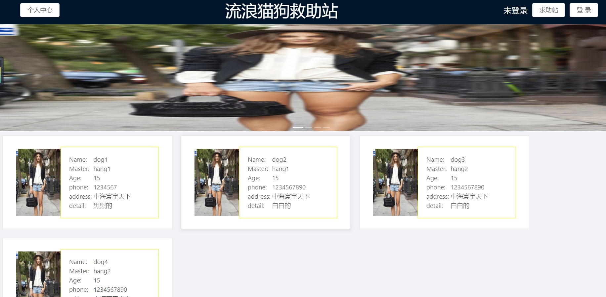
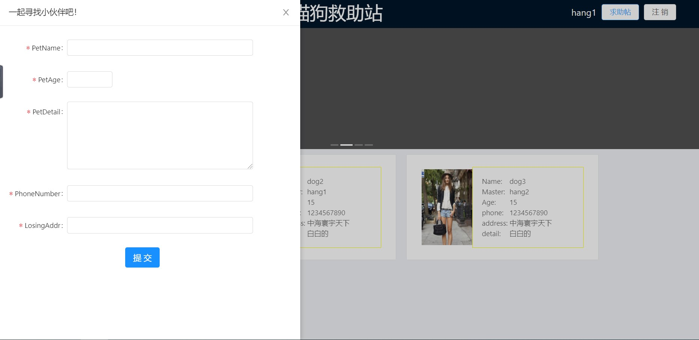
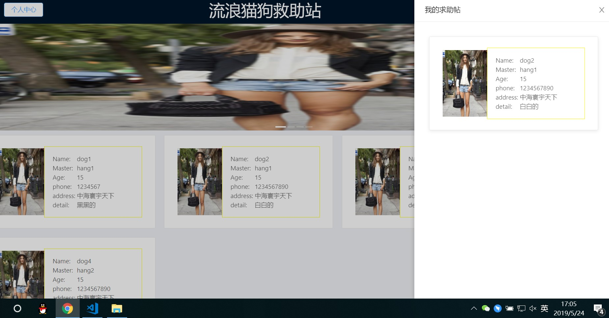

# 纯前端 React + Antd 教学--流浪猫狗救助站

## 简介

开始之前，先跟小伙伴们说一下~

本教程为 基础的 React + Antd 的教学，用于初学于此框架的小伙伴，若您已经精通于此，还望指点一二。本人虚心接受。

React 和 Antd 我会尽量讲解得细一些。如果还是不理解里面的含义，请直接复制百度即可。

开始前先给小伙伴介绍一下该 demo 的流程。放几张图上去，然后是我的讲解。



比较粗糙~，但是不影响教学~

首先，整体框架就长上图的样子。内容为轮播图(这个不说明)，和瀑布流形式的卡片。

头部为几个按钮：

求助帖(需要登录)：若未登录情况下，打不开。打开后为下图的样式。当点击提交时，页面上将显示出新增的卡片。



另一个按钮为个人中心(需要登录)：若未登录下打不开。打开后显示的是该用户发布的所有卡片。



## 搭建 React+Antd 框架

开发工具：vs Code。

### 一、创建 React 项目

在终端上键入 `create-react-app catAndDog`。

`catAndDog` 为你的项目名称。

在文件夹中打开目录，进入到 `src/` 下，删除所有的文件，然后创建两个新的文件：`index.js` 和 `index.css`。

在 `index.js` 文件中，加入下面的代码：

```js
import React from 'react';
import ReactDOM from 'react-dom';   
import 'index.css';             //上面的三行代码为头部文件

class FindDog extends React.Component { 
    render() {
        return (
            <div><div>
        )
    }
}

ReactDOM.render(
    <FindDog />,
    document.getElementById('root') 
)
```

解释一下上面的代码：

我理解为一个页面的初始代码,**`return` 里的最外层 `div` 只能有一个**。

所以你就用一个最外层 `div` 将内容包裹起来即可。

好了。那么现在分别键入 `npm i` 和 `npm start`，即可启动项目，你可以在 `div` 中放入几个代码看看效果。

### 二、搭建 Antd 环境

这里你页可以直接查看官网的[教程](https://ant.design/docs/react/use-with-create-react-app-cn),会详细的教你如何将 Antd 集成到 React 中。这里我也会快速讲解，需要了解为什么的请移步官网。

键入下面这三个命令：

```bash
//添加 antd 框架
$ npm install antd --save

//加载了全部的 antd 组件对前端性能可能是个隐患
//所以加上此命令行对配置文件自定义
$ npm install react-app-rewired --save-dev

//修改启动配置
$ npm install customize-cra --save-dev

//用于按需加载组件代码和样式的插件
$ npm install babel-plugin-import --save-dev
```

找到根目录下 `package.json` 修改下面的代码：

```json
/* package.json */
"scripts": {
-   "start": "react-scripts start",
+   "start": "react-app-rewired start",
-   "build": "react-scripts build",
+   "build": "react-app-rewired build",
-   "test": "react-scripts test",
+   "test": "react-app-rewired test",
}
```

在根目录下创建一个 `config-overrides.js` 的文件。

```js
const { override, fixBabelImports } = require('customize-cra');

 module.exports = override(
   fixBabelImports('import', {
     libraryName: 'antd',
     libraryDirectory: 'es',
     style: 'css',
      // style:true,
   }),
)
```

给 `index.js` 下的 `div` 加上下面的代码：

```js
<Button type="primary">Button</Button>
```

并且头部要补上 `import { Button } from 'antd';`

头部的文件请自行参考 [Antd 官网](https://ant.design/components/button-cn/) 里面很多的 demo 供你参考。

现在重启一下项目，如果你看到你的按钮是好看的蓝色，那么恭喜你成功的集成了 Antd。

如果不成功，请不要灰心，可能是我的教程有小问题，请移步到官网上去查看即可。

## 画出静态页面

我们可以使用 Antd 里的 `Layout` 布局。将页面分成头部和内容部分。

记住了！ **所有需要从 Antd 里取出来用的组件，都需要在头部进行定义**。

我们先来画一下头部文件。

```js
import { Layout } from 'antd';

const {Header, Content,} = Layout;

class FindDog extends React.Component {
    render() {
        return (
            <div>
                <Layout>
                    <Header className="header_main">
                        <div>
                            <Button>个人中心</Button>
                        </div>
                        <div className="header_title">
                            <Text className="header_text">流浪猫狗救助站</Text>
                        </div>
                        <div className="header_button_div">
                            <Text className="header_button_text">未登录</Text>
                            <Button>求助帖</Button>
                            <Button>登录</Button>
                        </div>
                    </Header>
                    <Content>
                        <div className="content_slider_div">这里放轮播图，用个div 占个位置意思一下</div>
                        <div className="content_card_div">瀑布流卡片</div>
                    </Content>
                </Layout>
            </div>
        )
    }
}
```

这里的样式我们用到 `flex` 布局。其实就是四个代码在运用而已。可以自行理解一下。还是不懂的话可以参考，这篇[博客](https://blog.csdn.net/onil_chen/article/details/76293294)。这篇博客已经写的非常的详细。花费不到半个小时的时间你就能掌握。

```css
.header_main{
    display: flex;
    flex-direction: row;
    align-items: center;
    justify-content: center; 
}

.header_title{
    display: flex;
    flex-direction: row;
    align-items: center;
    justify-content: center; 
    flex:1;
    -webkit-flex:1;
}
.header_button_div{
    display: flex;
    flex-direction: row;
    align-items: center;
    justify-content: center; 
}

.header_button_div button{
    margin-right:10px;
}
.header_button_text{
    color: white;
    padding-right: 10px;
    font-size: 18px;
}

.content_slider_div{
    /* border: 1px solid rebeccapurple; */
    height: 240px;
}

.content_card_div{
    display: flex;
    flex-direction: row;
    flex-wrap:wrap;
    /* align-items: left; */
    justify-content: left;
    /* height: 200px; */
}
```

好的。那么现在，整理的静态页面就算完成拉~


