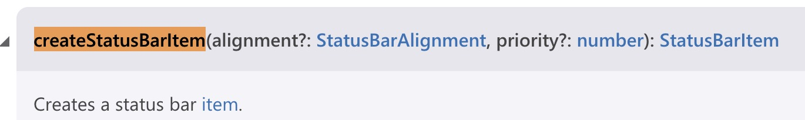

# VS code 插件开发2--- StatusBar 状态栏 教程文档

## 一、安装

关于安装，我在[VS Code插件开发教程--树视图+网页视图](https://blog.csdn.net/weixin_42278979/article/details/99063289)这里的开头有详细的介绍。如果是刚入门的小伙伴们请先花费5分钟的时间来这里看下如何安装以及最初的使用。

我在这里快速的讲解一遍，没看懂的小伙伴自行看上面的链接哈～

- 终端键入：`npm install -g yo generator-code`
- 终端键入 `yo code`
- 选择第一项 `New Extension (TypeScript)`
- 重新打开 vscode 进入该项目的目录下
- 按下 `F5` 启动插件
- 按下 `ctrl+shift+P` 或者 `command+chift+P` 弹出命令界面，输入 `Hello World` 点击回车
- 如果右下角弹出 `Hello World` 的消息，那么插件就创建成功了

**补充一点：** [官网api](https://code.visualstudio.com/api/references/vscode-api) 这里的 api 请大家一定要尽量学会用。一开始不会用看不懂很正常。每次遇到新的属性就上这里查一查，时间久了自然能摸出一点门道来。谷歌浏览器有翻译功能。

## 二、在状态栏上展示文字

我们将该功能详细写在一个 `.ts` 文件下。

在 `extension.ts` 的同级目录下创建 `WordCount.ts` 文件

导入我们需要的从 `vscode` 中获取到几个项

```ts
// 这里的知识都可以从 api 中查到哦
// 下文有 api 截图，请大家参考，不过还是希望小伙伴们能够自行查一下哈～
import { window, StatusBarItem, StatusBarAlignment } from 'vscode';

export class WordCount {

  // 定义一个状态栏的属性
  private statusBar : StatusBarItem | undefined;

  // 如果该属性不存在就创建一个
  if(!this.statusBar) {
    this.statusBar  = window.createStatusBarItem(StatusBarAlignment.Left);
  }

  this.statusBar.text = '这是我创建的第一个 StatusBar';
  this.statusBar.show();

} 
```




好了。完成了第一步。现在去启动插件并不能用，因为我们需要在 `extension.ts` 文件中去激活它，并使用它。

先打开 `package.json` 文件

找到 `activationEvents` 这个文字，学着像 `helloWorld` 那样注册一个**激活事件**，用户在键入命令后就能够激活该功能。

接下来找到 `contributes` 这个文字，也学着像 `helloWorld` 那样发布内容配置，绑定一个命令 ID，然后就可以在命令面板上使用了。

```json
"activationEvents": [
  "onCommand:extension.helloWorld",
  "onCommand:extension.wordCount"
],
"main": "./out/extension.js",
"contributes": {
  "commands": [{
    "command": "extension.helloWorld",
    "title": "Hello World"
  }, {
    "command": "extension.wordCount",
    "title": "wordCount"
  }]
},
```

接下来我们打开 `extension.ts` 文件

```ts
import { window } from 'vscode';
import { WordCount } from './WordCount';

export function activate(context: vscode.ExtensionContext) {
  ...

  // 实例化 WordCount
  let wordCount = new WordCount();

  // 函数绑定到你注册的命令ID
	context.subscriptions.push(vscode.commands.registerCommand('extension.wordCount', () => {
    
    // 调用 WordCount 里的 方法
		wordCount.updateWordCount();
		window.showInformationMessage('该插件为显示 md 文档输出的字符，请看 vs Code 左下角~');
	}));
}
```

好了现在 按下 `F5`, 按下`command+chift+P`, 输入 `wordCount`, 是否就能够看到 左下角状态栏上的文字和右下角弹出的消息框了呢。如果不行的小伙伴不要着急，对比下上面的代码有没有哪里写错了呢。

## 三、状态栏上显示文本的总字数

如果只是写死的文字那朵没意思，接下来我们来自动统计总字数的功能。

并且我希望只有在 `md` 文档的情况下才展示统计字数。其他情况下就不做展示。补充 `WordCount.ts` 里的代码

```ts
// TextDocument：表示文本文档，例如源文件 可以自行查看 api 哈
import { window, StatusBarItem, StatusBarAlignment, TextDocument } from 'vscode';
export class WordCount {
  private statusBar !: StatusBarItem ;

  public updateWordCount() {
    if(!this.statusBar) {
      this.statusBar  = window.createStatusBarItem(StatusBarAlignment.Left);
    }

    // 获取当前活动编辑器
    let editor = window.activeTextEditor;

    // 这个判断条件的代码很重要，如果删除下面的代码会报错，请小伙伴们一定要做该判断
    if(!editor) {
      this.statusBar.hide();
      return;
    }

    // 获取当前文档的全部信息
    let doc = editor.document;

    // 用来读取当前文件的语言 ID，判断是否是 md 文档
    if(doc.languageId === 'markdown') {
      let textNum = doc.getText().replace(/[\r\n\s]+/g, '').length;
      this.statusBar.text = textNum === 0 ? `目前还没有文字～` : `$(octoface)已经输出 ${textNum} 个字啦！！！`;
      this.statusBar.show();
    } else {
      this.statusBar.hide();
    }
  }

  // 销毁对象和自由资源
  dispose() {
		this.statusBar.dispose();
	}
}
```

`$(octoface)`: 这个是 [官网api](https://code.visualstudio.com/api/references/icons-in-labels) 小伙伴可以自行挑选自己喜欢的图标


总结一下这里的步骤哈：

- 先获取当前的文本编辑器
- 判断该文本编辑器是否存在(这点很重要)
- 判断当然语言ID 是否为 `md` 文档
- 若是：统计字数，显示在状态栏上

## 四、使该插件自动化，增加监听事件

小伙伴这个时候运行该插件应该就能发现如果你不打开 `md` 文档的话状态栏上的插件功能是无法显示出来的。

打开 `md` 文档后启用 `command+chift+P` 运行插件就能看到总字数会显示在状态栏上。

但是小伙伴应该会发现一个缺点：

就是：状态栏上的字数无法随着文档编写而变换，每次都要重新执行 `command+chift+P` 才能看到最新的文字字数。这实在是太不方便了。

有没有办法让我们当打开 `md` 文档时就自动统计字数，并且实时更新呢？接下来我们来实现一下～

接下来我们继续修改 `WordCount.ts` 文件的内容：

```ts
import { Disposable } from 'vscode';
export class WordCount {
  private statusBar!: StatusBarItem;

  // 给该类增加构造函数，类似与我们创建对象传递参数一样
  constructor() {

    // 当编辑器中的选择更改时触发的事件
    window.onDidChangeTextEditorSelection(this.updateWordCount,this);

    // 当活动编辑器 发生更改时将触发的事件
    window.onDidChangeActiveTextEditor(this.updateWordCount, this);
  }

  public updateWordCount() {...}

  // 对象和自由资源。
  // 这里的销毁代码很重要，小伙伴不要忘记了！！～～
  dispose() {
		this.statusBar.dispose();
	}
}
```


修改完 `WordCount.ts` 文件第二步就是修改 `package.json` 文件，打开 `package.json`

现在我们不再需要执行命令面板上的命令才启动插件，而是希望随时启动插件，或者当当前编辑器的语言ID为 `md` 时，自动启动插件。

所以现在我们的 `activationEvents` 激活事件不再需要 `onCommand` 命令启动类型。

而是替换成 `onLanguage:markdown` 或者 `*`, 意思为当语言ID为 `markdown` 时激活插件，或当项目启动时激活插件。不推荐使用后者。

既然 `onCommand` 命令已经不需要了。。那么 `contributes` -> `commands` 下就不再需要启动命令了。

```json
"activationEvents": [
  "onCommand:extension.helloWorld",     // 删除
  "onCommand:extension.wordCount",      // 删除
  "onLanguage:markdown"
],
"main": "./out/extension.js",
"contributes": {                       // 一整个都可以删除
  "commands": [{
    "command": "extension.wordCount",
    "title": "wordCount"
  }]
},
```

修改完 `package.json` 文件，最后一步就是修改 `extension.ts` 文件

```ts
import { WordCount } from './WordCount';
export function activate(context: vscode.ExtensionContext) {

  // 只需简简单单的二行代码即可
	let wordCount = new WordCount();
  context.subscriptions.push(wordCount);
}
```

因为我们激活函数不再需要命令去启动插件，所以不再需要 `vscode.commands.registerCommand`

在 `WordCount` 类中， 我们增加了 `dispose()` 销毁事件，所以能够直接 `context.subscriptions.push()` 该类。

好了小伙伴们现在去测试一下效果吧。。

## 五、来个小tip(弹框显示选中的文字)

这里我就用比较简单的伪代码来实现

在 `WordCount.ts` 文件中新增一下代码：

```ts
// 获取文本编辑器选中项
const selection = editor.selection;
const text = editor.document.getText(selection);
window.showInformationMessage(text);
```

可以直接去测试下效果哈～

## 六、再来个小tip(显示选中多少行文本)

```ts
// 将激活的文本编辑器传入到下面的函数中
public updateStatusBarItem(editor: TextEditor | undefined): number {
  let lines = 0;
  if(editor) {
    lines = editor.selections.reduce((prev,curr) => prev + (curr.end.line - curr.start.line),0);
  }
  return lines;
}
```

在 `WordCount.ts` 文件中创建以上方法，将激活的文本编辑器传入该方法，就能返回行数了。

如果小伙伴想也在将选中的行数展示在状态栏上的话，请重复上面的代码，创建一个 `StatusBarItem`，给它赋值即可。

**注意**

当我们用 `window.showInformationMessage` 去展示一个 `number` 类型的值是不行的。需要转化为 `string` 类型才可以


