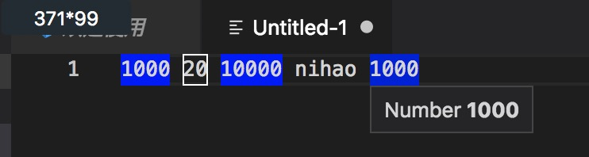
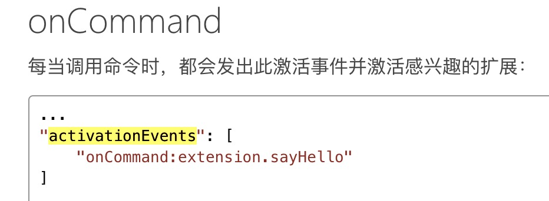
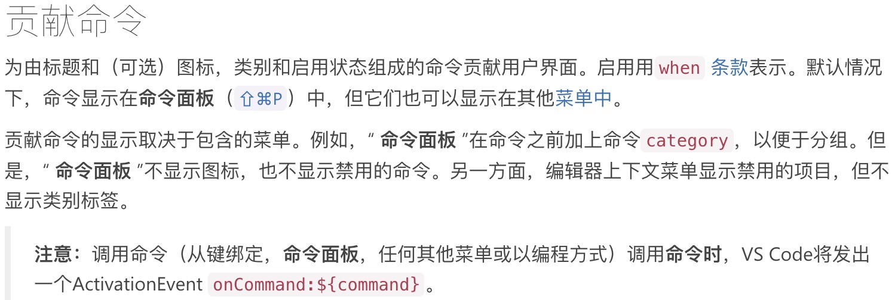
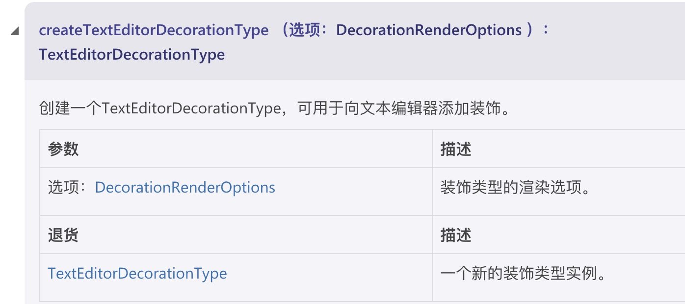
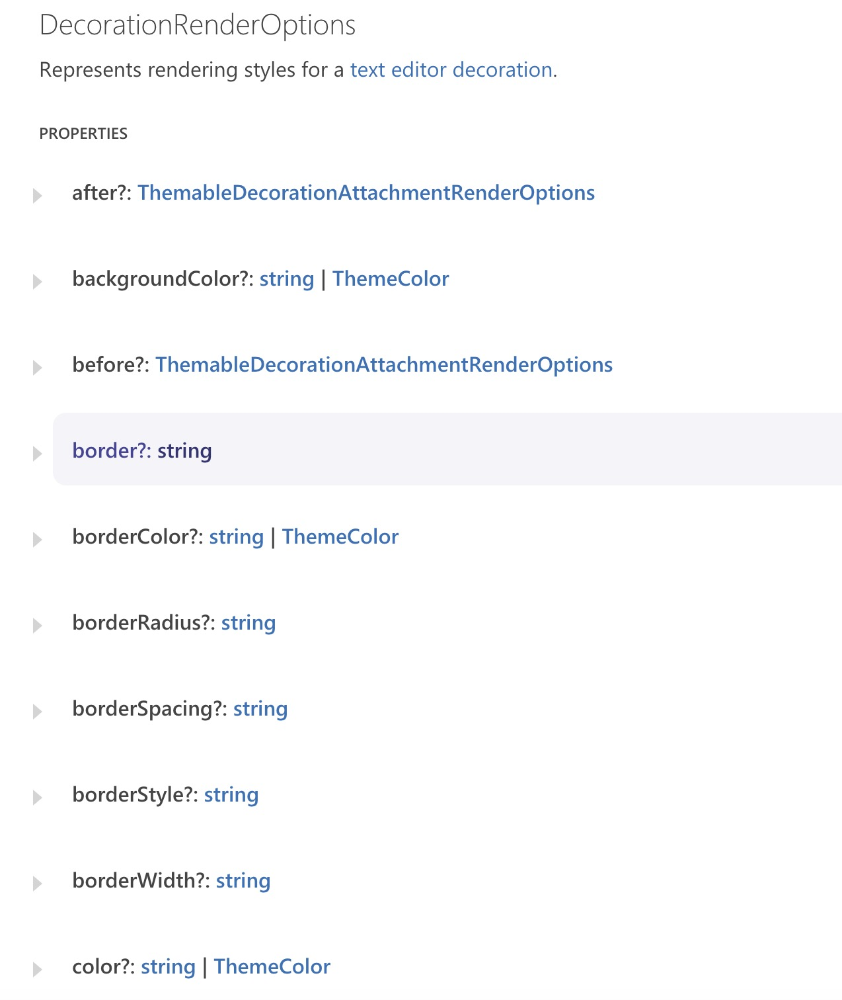
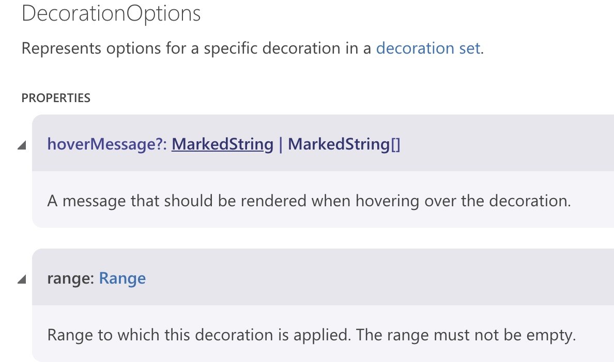
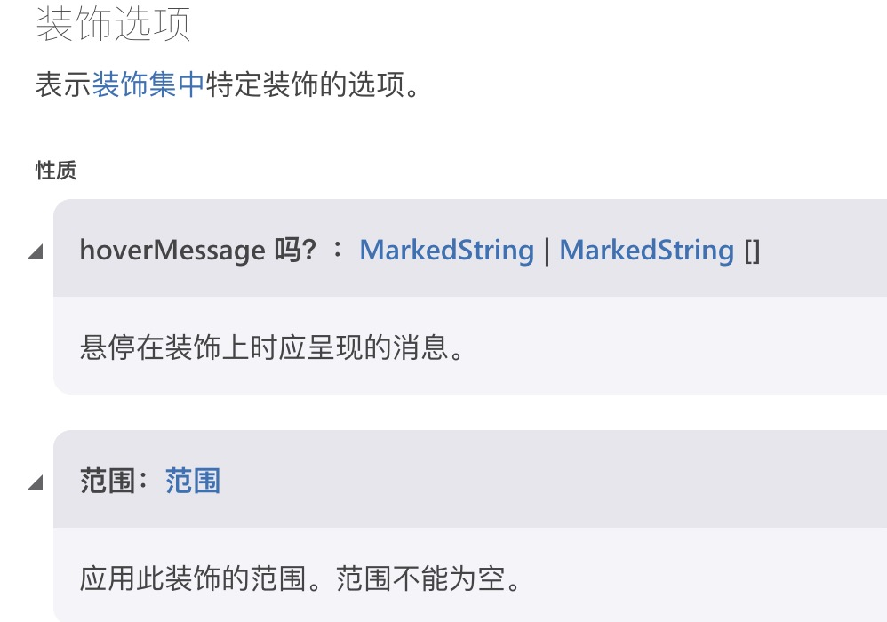
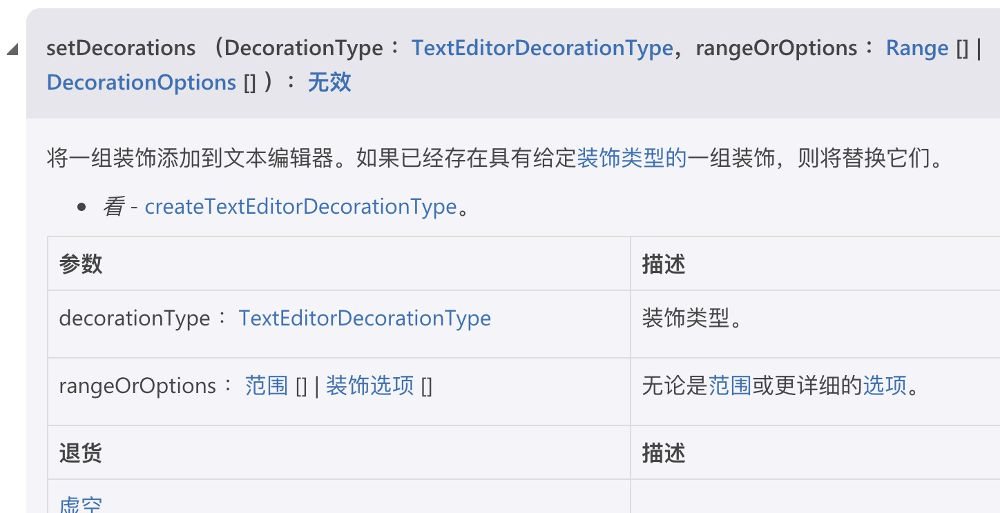
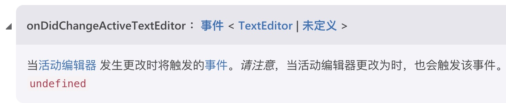

# VS code 插件开发3 --- 装饰数字(官网demo) 教程文档

## 一、效果展示



小伙伴们，今天我们来学习一下如果装饰我们想要的内容。如果数字长度3展示一种样式，长度小于3的话展示另一种样式。

## 二、安装

关于安装，我在[VS Code插件开发教程--树视图+网页视图](https://blog.csdn.net/weixin_42278979/article/details/99063289)这里的开头有详细的介绍。如果是刚入门的小伙伴们请先花费5分钟的时间来这里看下如何安装以及最初的使用。

我在这里快速的讲解一遍，没看懂的小伙伴自行看上面的链接哈～

- 终端键入：`npm install -g yo generator-code`
- 终端键入 `yo code`
- 选择第一项 `New Extension (TypeScript)`
- 重新打开 vscode 进入该项目的目录下
- 按下 `F5` 启动插件
- 按下 `ctrl+shift+P` 或者 `command+chift+P` 弹出命令界面，输入 `Hello World` 点击回车
- 如果右下角弹出 `Hello World` 的消息，那么插件就创建成功了

**补充一点：** [官网api](https://code.visualstudio.com/api/references/vscode-api) 这里的 api 请大家一定要尽量学会用。一开始不会用看不懂很正常。每次遇到新的属性就上这里查一查，时间久了自然能摸出一点门道来。谷歌浏览器有翻译功能。

## 三、创建功能文件框架

如果有看过 [VS Code插件开发教程2 -- StatusBar 状态栏](https://blog.csdn.net/weixin_42278979/article/details/102534759)的小伙伴应该会知道

我们会创建一个 `.ts` 文件用来放功能性代码，而 `extension.ts` 文件只负责激活插件。

我们在 `extension.ts` 文件的同级目录下创建一个 `DecorationNumber.ts` 文件

```ts
import { window } from 'vscode';

export class DecorationNumber {

  constructor() {}

  // 创建一个方法，一会我们会把功能代码编写在此
  public DecNumber() {
    window.showInformationMessage('装饰数字');
  }

  dispose() {}
}
```

我们来详细介绍下上面的小框架

`constructor`: 给该类增加构造函数，类似与我们创建对象传递参数一样

`dispose()`: 销毁对象和自由资源，比如我们在构造函数中创建了一些内容，就需要在这个方法中进行销毁，如果没有内容需要销毁的话，就像我上面那样写个空函数在那里。

**`dispose()` 很重要，如果不写后面会报错哈！希望小伙伴们谨记**

接下来我们先让 `DecNumber()` 方法能够跑起来，一步一步慢慢来不会错哈。

打开 `package.json` 文件，编辑它：

```json
"activationEvents": [                           // 创建激活事件
  "onCommand:extension.decorationNumber"        // 创建激活该插件的命令
],
"main": "./out/extension.js",
"contributes": {                                // 配置实例
  "commands": [{                                // 命令面板
    "command": "extension.decorationNumber",
    "title": "decNumber"
  }]
},
```

讲解下上面的代码(以下是官网截图)：






最后一步 打开并编辑 `extension.ts`:

```ts
import { DecorationNumber } from './DecorationNumber';
export function activate(context: vscode.ExtensionContext) {
  // 实例化放类
  let decorationNumber = new DecorationNumber();

  // 当执行 'extension.decorationNumber' 命令时，掉用类中的方法
	context.subscriptions.push(vscode.commands.registerCommand('extension.decorationNumber', () => {
		decorationNumber.DecNumber();
	}))
}
```

好了。现在我们按下 `F5` 测试下效果吧。

启动插件后按下 `command + shift + P`, 键入 `decNumber`, 如果右下角有消息弹框，并且显示的是我们编写的消息的话，那么就对了哈～

## 四、专注装饰数字核心代码

好了，接下来我们来编写 `DecorationNumber.ts` 文件中，`DecNumber()` 方法吧。

代码有些小长，不过不着急，代码下面有官网截图来解释。其实写的密一些的话没几行的～

```ts
import { window, DecorationOptions, Range, workspace, TextEditor } from 'vscode';

// createTextEditorDecorationType 用于向文本添加装饰
const smallNumDecoration = window.createTextEditorDecorationType ({
  border: '1px',
  borderStyle: 'solid',
  borderColor: '#fff',
});

const bigNumDecoration = window.createTextEditorDecorationType ({
  backgroundColor: 'blue'
});

export class DecorationNumber {

  // 获取当前活动编辑器
  private editor: TextEditor | undefined;

  constructor() {
    this.editor = window.activeTextEditor;
  }

  public DecNumber() {

    // 这个判断条件的代码很重要，如果删除下面的代码会报错，请小伙伴们一定要做该判断
    if(!this.editor) { return; }

    // 获取当前文档的全部信息
    let doc = this.editor.document;

    // 获取文档中的全部内容
    let text = doc.getText();

    // 创建两个用来存放正则判断出来的数字的数组
    let smallNumbers: DecorationOptions[] = [];
    let bigNumbers: DecorationOptions[] = [];
    
    const regEx = /\d+/g;

    let match;
    while(match = regEx.exec(text)) {
      // 获取数字开始和结束的位置
      const startPos = doc.positionAt(match.index);
      const endPos = doc.positionAt(match.index + match[0].length);
  
      // 下面有截图 主要是获取数字的位置范围，并且当鼠标覆盖时，有我们想要的文字展示
      const decoration = {
        range: new Range(startPos, endPos),
        hoverMessage: 'Number **' + match[0] + '**',
      };

      // 根据不同的长度分别存入不同的数组中
      if(match[0].length < 3) {
        smallNumbers.push(decoration);
      } else {
        bigNumbers.push(decoration);
      }
    }

    // 下方有截图，将一组装饰添加到文本编辑器
    this.editor.setDecorations(smallNumDecoration, smallNumbers);
    this.editor.setDecorations(bigNumDecoration, bigNumbers);
  }
}
```












看完官网 api，我总结下这小结的代码哈：

- 设计两个文字样式(这里要放在类外面！！请注意)
- 获取编辑器文字内容
- 使用正则进行判断，并获取在文本中的位置
- 将数组和修饰的样式设置到编辑器中

好了小伙伴们，现在再按下 `F5` 去测试下吧，创建个文件，输入有些数字，启动命令面板输入命令来激活效果吧。

## 五、自动执行装饰数字插件

如果我们做的这个插件要每次去命令面板才能执行命令的话，那体验真的是非常的差劲。所以这一步我们要做的就是让插件自动执行。

思路：

- 监听文本文档，当内容发生变化时自动执行 `DecorationNumber.ts` 下的 `DecNumber()` 方法
- 改变插件的启动方式，不再使用命令启动插件

下面先介绍下这两个方法。我们在 `DecorationNumber.ts` 的构造函数中去使用这两个监听方法




```ts 
//  最简写法
constructor() {
  this.editor = window.activeTextEditor;

  window.onDidChangeActiveTextEditor(() => {
    this.editor = window.activeTextEditor;
    this.DecNumber(); 
  });

  workspace.onDidChangeTextDocument(() => {
    this.DecNumber();
  });
}

// 第二种：较标准写法
constructor() {
  this.editor = window.activeTextEditor;

  window.onDidChangeActiveTextEditor(editor => {
    // 当编辑器切换面板时，editor 就变成了 undefined，所以要重新设置
    this.editor = window.activeTextEditor;
    if(editor) { this.DecNumber(); }
  })

  workspace.onDidChangeTextDocument(event => {
      if (this.editor && event.document === this.editor.document) {
        this.DecNumber();
      }
  })
}
// 两种方法都行哈～
```

增加完了监听事件，第二步去修改 `package.json` 文件。

```json
"activationEvents": [
  "*",                                          // 代表项目一启动就激活插件，可以只用这个就行
  "onLanguage:markdown",                        // 代表当文档类型为 md 时，我自动启动插件
  "onLanguage:typescript"                       // 代表当文档类型为 ts 时，我自动启动插件
],
"main": "./out/extension.js",
"contributes": {                                // 一整个模块都可以删除
  "commands": [{                                // 删除
    "command": "extension.decorationNumber",    // 删除
    "title": "decNumber"                        // 删除
  }]
},
```

最后我们修改下 `extension.ts` 文件

```ts
// 就这么简单
export function activate(context: vscode.ExtensionContext) {

	let decorationNumber = new DecorationNumber();
	context.subscriptions.push(decorationNumber);

}
```

## 六、注意事项！！！

- `DecorationNumber.ts` 文件框架中的 `dispose() {}` 方法，不能删除，否则上面的 `context.subscriptions.push(decorationNumber);` 代码会报错
- 向文本添加装饰的 `smallNumDecoration`、`bigNumDecoration` 属性不能放在方法 `DecNumber()` 中，否则插件效果有误，小伙伴可以一试。

## 七、控制插件执行速度

是否我们没必要一旦光标改变就执行该插件呢？如果不做限制会不会因为执行过多而影响到性能优化呢？

我们来做一个定时器。

继续修改 `DecorationNumber.ts` 文件，下面是伪代码，大家自行理解哈，应该不难才对

```ts
export class DecorationNumber {
  private timeout: NodeJS.Timer | undefined;

  constructor() {
    this.editor = window.activeTextEditor;
    this.timeout = undefined;
    window.onDidChangeActiveTextEditor(() => {
      this.editor = window.activeTextEditor;
      this.triggerUpdateDecorations(); 
    });

    workspace.onDidChangeTextDocument(() => {
      this.triggerUpdateDecorations();
    });
  }

  public triggerUpdateDecorations() {
    if(this.timeout) {
        clearTimeout(this.timeout);
        this.timeout = undefined;
    }
    this.timeout = setTimeout(this.DecNumber(), 500);
  }
}
```

讲解一下：

- 新增一个私有的定时器属性
- 编写一个方法重新设置定时器
- 在初始化的监听事件中调用它

在 `setTimeout(this.DecNumber(), 500);` 可能会存在报错。没事哈，粗暴一点，直接执行。


