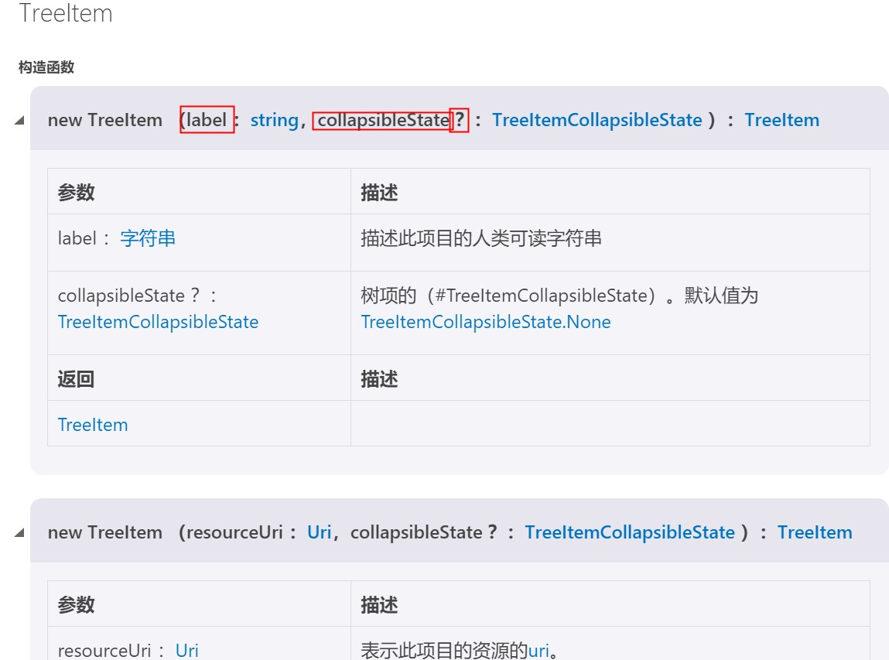

# VS code 插件开发--- treeView + webView 教程文档

## 一、安装

用 VS code 打开一个新建项目存放位置的目录

从命令行安装 `Yeoman` 和 `VSCode` 插件生成器(`generator-code`), 安装了 `generator-code` 才能进行插件开发：

终端键入：`npm install -g yo generator-code`.

安装完成后，键入 `yo code` 创建新项目(如果你看到一个小小机器人，那么就对了)：

创建项目时会有几个让你需要你输入地方：

```
? What type of extension do you want to create? (Use arrow keys)(选择你想要创建插件的类型)
> New Extension (TypeScript)
  New Extension (JavaScript)
  New Color Theme
  New Language Support
  New Code Snippets
  New Keymap
  New Extension Pack
(Move up and down to reveal more choices)
```

我们选择第一项 `New Extension (TypeScript)`。

接下来你还有遇到几个输入项：

```
What's the name of your extension?(你的扩展的名称是什么?) newTreeView
What's the identifier of your extension? (newtreeview)(你扩展的标识符是什么?(newtreeview)) 这里直接按回车即可
What's the description of your extension?(您的扩展的描述是什么?) newTreeView
Initialize a git repository? (Y/n)(初始化一个git仓库吗?) n
Which package manager to use? (Use arrow keys)(使用哪一个包管理器?) 下面两个都可以选择，建议选择 yarn
> npm
  yarn
```

很好那么现在项目就创建成功了。进去项目运行一下看看效果吧。

终端键入：

```bath
$ cd newtreeview/       进入该项目

$ code .                打开该项目的同级目录(这就是我们以后该插件打开和使用的目录)
```

是否看到的是下面这样的目录呢，如果是那么就正确啦。

```
.
├── .gitignore
├── .vscode                     // VS Code 集成配置
│   ├── launch.json
│   ├── settings.json
│   └── tasks.json
├── .vscodeignore
├── README.md
├── src                         // 源码
│   └── extension.ts			// 如果是JavaScript插件，那么此处就是extension.js
├── test                        // 测试文件夹
│   ├── extension.test.ts	   // 如果是JavaScript插件，那么此处就是extension.test.js
│   └── index.ts	            // 如果是JavaScript插件，那么此处就是index.js
├── node_modules
│   ├── vscode                  // 语言服务
│   └── typescript              // typescript编译器(仅TypeScript插件才有)
├── out                         // 编译结果(仅TypeScript插件才有)
│   ├── src
│   |   ├── extension.js
│   |   └── extension.js.map
│   └── test
│       ├── extension.test.js
│       ├── extension.test.js.map
│       ├── index.js
│       └── index.js.map
├── package.json                // 插件的清单
├── tsconfig.json               // 如果是JavaScript插件，那么此处就是jsconfig.json
├── typings                     // 类型定义文件
│   ├── node.d.ts               // 链接到Node.js的API
│   └── vscode-typings.d.ts     // 链接到VS Code的API
└── vsc-extension-quickstart.md // 插件开发快速入门文档
```

## 二、初识 VS code 插件 demo

先不管代码是什么，我们先运行一下这个插件吧。

按下 `F5` 稍等片刻。

会创建出一个新的 VS code 窗口，标题栏写着 `扩展开发宿主`

这时我们按下 `ctrl+shift+P` 弹出命令界面，输入 `Hello World` 点击回车

你就会看到 VS code 右下角弹出 `Hello World` 的信息。

这就是最原始的插件 demo，代码已经帮我们编辑好了，我们来理解一下怎么实现的吧。

开始项目的第一步是 **打开 package.json**。

里面的 `contributes` 下所有节点信息都可以通过[官网 contribution-points](https://code.visualstudio.com/api/references/contribution-points)

`contributes`: 下的节点很重要请小伙伴们能够仔细去看下上面的官网：

因为量太多，这里我们只介绍重点节点：

`commands`:  

```json
"contributes": {
    "commands": [{
        "command": "extension.helloWorld",      // 自定义的命令
        "title": "Hello World",                 // 我们在命令选板上能够搜索出此命令的标题
        "category": "Hello"                     // 类别：对命令进行简单的分组，使查询时更加清晰
    }],
    "keybindings": [                            // 我新增的内容：提供一个键绑定规则
        {
            "command": "extension.helloWorld",  // 上面 commands 定义过的命令
            "key": "ctrl+f1",                   // window 下配置的按键
            "mac": "cmd+f1"                     // mac 下配置的按键
        }
    ]
},
"activationEvents": [                           // 这应该是写在 contributes 上面的，用来激活命令
    "onCommand:extension.helloWorld"            // onCommand  为只要调用命令，就会激活插件
]
```

**这里强调一个重点**：

**`.json` 格式的样式编辑很严格，不该加 `,` 的地方，如果加了就会报错，比如：每个 `{}` 里的最后一项,比如：只能用`""`, 不能用`''`**。

重要的事情说三遍！！！
重要的事情说三遍！！！
重要的事情说三遍！！！

好的目前在这最简单的 demo 中 `package.json`  下的东西我们已经说完了，后面的内容还会继续补充其他的内容，接下来我们先来看看 `src/extension.ts` 文件。

```ts
// 模块'vs code'包含vs代码扩展性API
// 导入模块并在下面的代码中用别名vscode引用它
import * as vscode from 'vscode';

// activate: 激活插件时调用此方法，你的插件在第一次执行命令时被激活
export function activate(context: vscode.ExtensionContext) {
    console.log(`我们可以在终端下的'调试控制台' 看到我们输出的消息`);

    // 该命令已在package.json文件中定义
	// 现在为命令的实现提供 registercommand(我理解就是当你执行该命令要做什么事)
	// commandid参数必须与package.json中的命令字段匹配。(一定要一致，否则插件读取不到)
    let disposable = vscode.commands.registerCommand('extension.helloWorld', () => {
        // 弹出右下角的消息框，就是我们运行插件时看到的右下角的 `Hello World!` 的提示
		vscode.window.showInformationMessage('Hello World!');
	});

    // 发布注册的命令，发布才能使用
	context.subscriptions.push(disposable); 
}

// 当插件停用是调用此方法，一般可以放空
export function deactivate() {}
```

## 三、treeView: 重识 package.json

在重新编写 `package.json` 文件之前，我们先到 [阿里巴巴矢量图标库](https://www.iconfont.cn/)中下载一下我们想要的图标文件。

尽量不要选择黑白的图片，然后**下载文件格式为 `svg`,下载大小为 32*32**,

文件格式关乎图片能不能展示出来，大小关乎图标的样式，所以小伙伴们注意下载的格式。

下载完以后我们在 `src` 目录下创建一个文件夹 `assert` 用来存放图片。

好了我下载的目录长这个样子，小伙伴们可以参考一下。

```
.
├── .assert                     
│   ├── pig.svg
│   ├── pig1.svg
│   ├── pig2.svg
│   ├── pig3.svg
```

现在我们来重新修改一下 `package.json` 的代码, 编辑 `contributes` 下面的新增如下内容

```json
...
"contributes": {
    "commands": [{
        "command": "extension.helloWorld",
        "title": "Hello World"
    }],
    "viewsContainers": {                        // 提供自定义视图的视图容器
        "activitybar": [                        // 目前，只能将它们提供给活动栏(activitybar)
            {
                "id": "treeView",               // 必填：视图容器的 id
                "title": "treeView",            // 必填：视图容器的标题
                "icon": "src/assert/pig.svg"    // 必填：视图容器的图标
            }
        ]
    },
    "views": {                                  // 为 VS code提供视图
        "treeView": [                           // 为刚创建的 "treeView" 提供视图
            {
                "id": "treeView-item",          // 必填：视图 Id
                "name": "item",                 // 必填：视图的名称
                "when": ""                      // 非必填：可以控制何时出现该视图
            }
        ]
    }
},
"activationEvents": [                           // 激活视图
    "onCommand:extension.helloWorld",
    "onView:treeView-item"                      // 只要展开指定ID的视图，就会激活插件
]
...
```

目前 `package.json` 先完成至此，下面的教程会在继续补充。

好的，现在再次按下 `F5` 运行一下插件，看看是否出现下图的情况，如果是，那么恭喜你，代码无误啦~


## 四、treeView: 在视图中显示想要的 item

首先，我们先在 `src` 下创建 `TreeViewProvider.ts` 文件。重要的代码都展示在这里了。

```ts
import { TreeItem, TreeItemCollapsibleState, TreeDataProvider, Uri, window } from 'vscode';
import { join } from 'path';
```

这里重点讲解一下上面这两句代码：

`vscode` 提供了很多的 API 让我们使用，我们可以打开[官网 VS code API](https://code.visualstudio.com/api/references/vscode-api) 

我讲解一下上面需要用到的几个项：

`TreeItem`: 



创建 `TreeItem` 类型的构造函数，传递参数 `label`、`collapsibleState`.

`label`: tree 该项的标题。

`collapsibleState`: 该项是否折叠状态。参数有三： Collapsed(折叠状态)、Expanded(展开状态)、None(无状态)。

`?`: 代表参数为非必填项，可不传。**注意：非必填项，必须放在最后面**

`TreeItemCollapsibleState`: 就是 `collapsibleState` 的类型。

`TreeDataProvider`: 为树数据的数据提供程序(如果不理解，可以先放着，一会看代码)。

`Uri`: 通用资源标识符，表示磁盘上的文件或其他资源(用来读取文件路径)。

`join`: 用来拼接文件路径。

```ts
import { TreeItem, TreeItemCollapsibleState, TreeDataProvider, Uri, window } from 'vscode';
import { join } from 'path';

// 创建每一项 label 对应的图片名称
// 其实就是一个Map集合，用 ts 的写法
const ITEM_ICON_MAP = new Map<string, string>([
    ['pig1', 'pig1.svg'],
    ['pig2', 'pig2.svg'],
    ['pig3', 'pig3.svg']
]);

// 第一步：创建单项的节点(item)的类
export class TreeItemNode extends TreeItem {
    constructor(
        // readonly 只可读
        public readonly label: string,
        public readonly collapsibleState: TreeItemCollapsibleState,
    ){
        super(label, collapsibleState);
    }

    // command: 为每项添加点击事件的命令
    command = {
        title: this.label,          // 标题
        command: 'itemClick',       // 命令 ID
        tooltip: this.label,        // 鼠标覆盖时的小小提示框
        arguments: [                // 向 registerCommand 传递的参数。
            this.label,             // 目前这里我们只传递一个 label
        ]
    }
    // iconPath： 为该项的图标因为我们是通过上面的 Map 获取的，所以我额外写了一个方法，放在下面
    iconPath = TreeItemNode.getIconUriForLabel(this.label);

    // __filename：当前文件的路径
    // 重点讲解 Uri.file(join(__filename,'..', '..') 算是一种固定写法
    // Uri.file(join(__filename,'..','assert', ITEM_ICON_MAP.get(label)+''));   写成这样图标出不来
    // 所以小伙伴们就以下面这种写法编写
    static getIconUriForLabel(label: string):Uri {
        return Uri.file(join(__filename,'..', '..' ,'src' ,'assert', ITEM_ICON_MAP.get(label)+''));
    }
}
```


接下来我们就会用到 `TreeDataProvider`: 为树数据的数据提供程序。


当我们编写完上面的代码时，我们命名的 class 会报错，但是没关系鼠标覆盖报错的地方，选中 `快速修复`,就会弹出如上的标签。确认即可。

来看看完整的代码,继续在 `TreeViewProvider.ts` 上编写：

```ts
export class TreeItemNode extends TreeItem {
    ...
}

export class TreeViewProvider implements TreeDataProvider<TreeItemNode>{
    // 自动弹出的可以暂不理会
    onDidChangeTreeData?: import("vscode").Event<TreeItemNode | null | undefined> | undefined;    
    
    // 自动弹出
    // 获取树视图中的每一项 item,所以要返回 element
    getTreeItem(element: TreeItemNode): TreeItem | Thenable<TreeItem> {
        return element;
    }

    // 自动弹出，但是我们要对内容做修改
    // 给每一项都创建一个 TreeItemNode
    getChildren(element?: TreeItemNode | undefined): import("vscode").ProviderResult<TreeItemNode[]> {
        return ['pig1','pig2','pig3'].map(
            item => new TreeItemNode(
                item as string,
                TreeItemCollapsibleState.None as TreeItemCollapsibleState,
            )
        )
    }

    // 这个静态方法时自己写的，你要写到 extension.ts 也可以
    public static initTreeViewItem(){
        // 实例化 TreeViewProvider
        const treeViewProvider = new TreeViewProvider();
        // registerTreeDataProvider：注册树视图
        // 你可以类比 registerCommand(上面注册 Hello World)
        window.registerTreeDataProvider('treeView-item',treeViewProvider);
    }
}
```

最后一步: 完善 `extension.ts` 

```ts
import * as vscode from 'vscode';
// 引入 TreeViewProvider 的类
import { TreeViewProvider } from './TreeViewProvider';

export function activate(context: vscode.ExtensionContext) {
	context.subscriptions.push(vscode.commands.registerCommand('extension.helloWorld', () => {
		vscode.window.showInformationMessage('Hello World!');
	}));
    // 实现树视图的初始化
	TreeViewProvider.initTreeViewItem();
    
    // 还记得我们在 TreeViewProvider.ts 文件下 TreeItemNode 下创建的 command 吗？
    // 创建了 command 就需要注册才能使用
    // label 就是 TreeItemNode->command 里 arguments 传递过来的
    context.subscriptions.push(vscode.commands.registerCommand('itemClick', (label) => {
		vscode.window.showInformationMessage(label);
	}));
}
export function deactivate() {}
```

好了完成到这里如果小伙伴们启动插件的话，会出现报错。为什么呢？

因为 命令：`itemClick` 没有激活

打开 `package.json` 找到 `activationEvents` 补上： `"onCommand:itemClick"` 即可。

去验证一下吧。


